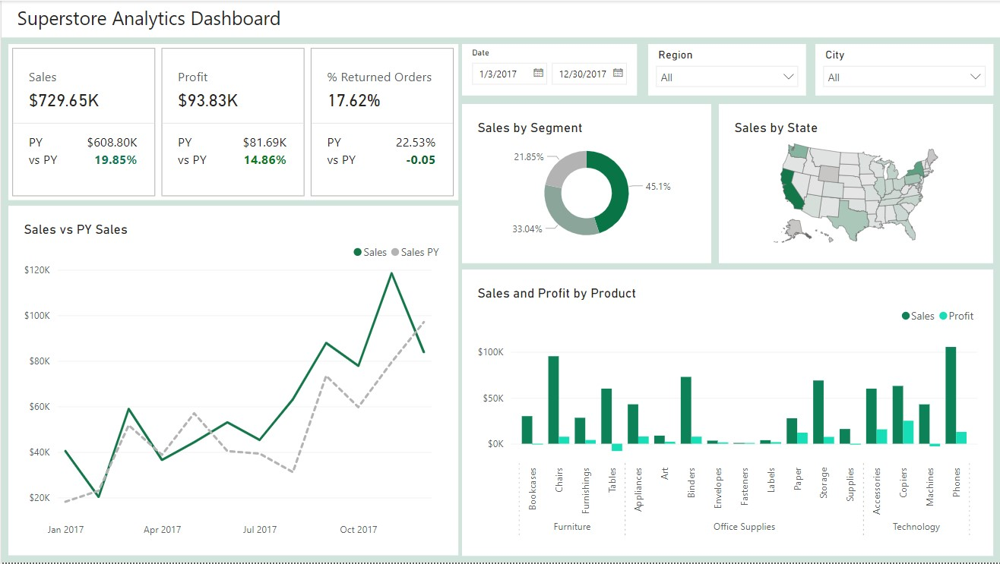
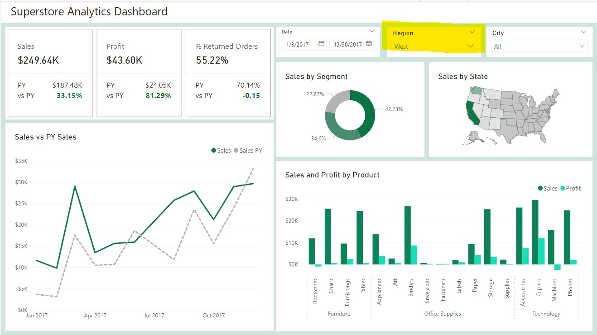

This a Power BI dashboard to analyze key financial metrics for a company, including trends in sales, profit, returns, products, and regional performance.

Dashboard initially

The dashboard highlights 3 KPIs - Sales, Profit and % of Returned Orders and compares the trend to the previous year. This is followed by a line chart further showcasing the trend of increased sales YoY.
On the right hand side there are Sales by Customer Segment and Sales by State overview charts, followed by a breakdown of Sales and Profit for each product.

The dashboard can be filtered by dates, region and city if the manager wishes to dig deeper into the data.

 
Dashboard interactively changes after you make a selection, in this case, filter for the West region.

You can download the interactive dashboard from this repository or else use this link to access it: [Superstore Analytics](https://app.powerbi.com/reportEmbed?reportId=46c0dd0d-0867-43dc-951d-e81755d2d844&autoAuth=true&ctid=128753ab-cb28-4f82-9733-2b9b91d2aca9) 
